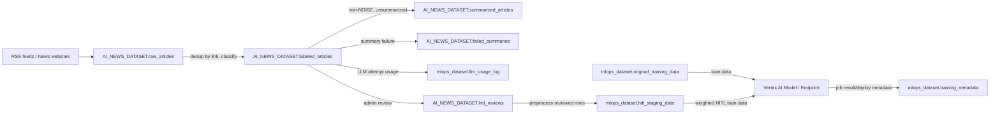

# Google Cloud BigQuery Data ERD

Tai lieu nay tong hop cac bang du lieu Google Cloud/BigQuery duoc suy ra tu source code.

Luu y quan trong:

- BigQuery trong he thong khong khai bao foreign key vat ly. Cac quan he ben duoi la quan he logic duoc suy ra tu `JOIN`, `MERGE`, `INSERT` va schema trong code.
- Dataset tin tuc duoc cau hinh bang bien moi truong. Cloud Functions dang mac dinh `ai_news_data`, trong khi Backend/ModelVision co default `ai_news`. Trong so do dung alias `AI_NEWS_DATASET` de chi dataset thuc te dang deploy.
- Dataset MLOps mac dinh la `mlops_dataset`.

## So Do Quan He Tong The

```mermaid
erDiagram
    RAW_ARTICLES {
        STRING id PK
        STRING title
        STRING link UK
        STRING source
        STRING pub_date
        STRING content
        TIMESTAMP crawl_date
        STRING crawl_status
        INTEGER content_length
    }

    LABELED_ARTICLES {
        STRING id PK
        STRING title
        STRING link UK
        STRING source
        STRING pub_date
        STRING content
        TIMESTAMP crawl_date
        STRING label
        STRING confidence
        FLOAT64 confidence_score
        STRING model_used
        TIMESTAMP labeled_at
    }

    SUMMARIZED_ARTICLES {
        STRING id PK
        STRING source_id FK
        STRING title
        STRING link FK
        STRING source
        STRING pub_date
        STRING label
        STRING summary
        STRING key_points
        STRING keywords
        STRING model_used
        STRING prompt_version
        TIMESTAMP summarized_at
    }

    FAILED_SUMMARIES {
        STRING id PK
        STRING source_id FK
        STRING link FK
        STRING error_type
        STRING error_message
        INTEGER attempt_count
        STRING model_used
        STRING prompt_version
        TIMESTAMP failed_at
        BOOLEAN resolved
    }

    HITL_REVIEWS {
        STRING article_id PK_FK
        STRING status
        STRING action
        STRING human_corrected_label
        TIMESTAMP reviewed_at
        BOOLEAN is_used_for_retraining
    }

    HITL_STAGING_DATA {
        STRING row_id PK
        STRING article_id FK
        STRING title
        STRING content
        STRING text_tok
        STRING label
        INT64 label_enc
        STRING action
        TIMESTAMP reviewed_at
        TIMESTAMP created_at
        STRING data_source
    }

    ORIGINAL_TRAINING_DATA {
        STRING text_tok
        STRING label
        INT64 label_enc
        STRING split
        TIMESTAMP created_at
    }

    TRAINING_METADATA {
        STRING job_id PK
        STRING status
        TIMESTAMP triggered_at
        TIMESTAMP completed_at
        FLOAT64 accuracy
        STRING best_model
        INT64 rows_original
        INT64 rows_hitl
        STRING model_resource_name
        STRING endpoint_resource_name
    }

    LLM_USAGE_LOG {
        STRING request_id PK
        STRING runtime_name
        STRING provider
        STRING model_name
        STRING prompt_version
        TIMESTAMP started_at
        INTEGER latency_ms
        BOOLEAN success
        STRING error_type
        INTEGER input_tokens
        INTEGER output_tokens
        INTEGER total_tokens
        STRING token_source
        FLOAT cost_estimate_usd
        STRING source_id FK
        STRING link FK
        INTEGER attempt_number
        BOOLEAN use_vertex
        STRING vertex_location
        INTEGER max_retries
        INTEGER max_content_chars
        FLOAT gemini_delay
        FLOAT input_token_price_usd_per_1k
        FLOAT output_token_price_usd_per_1k
    }

    RAW_ARTICLES ||--o| LABELED_ARTICLES : "link -> link"
    LABELED_ARTICLES ||--o| SUMMARIZED_ARTICLES : "id -> source_id"
    LABELED_ARTICLES ||--o| SUMMARIZED_ARTICLES : "link -> link"
    LABELED_ARTICLES ||--o{ FAILED_SUMMARIES : "id/link -> source_id/link"
    LABELED_ARTICLES ||--o{ LLM_USAGE_LOG : "id/link -> source_id/link"
    LABELED_ARTICLES ||--o| HITL_REVIEWS : "id -> article_id"
    HITL_REVIEWS ||--o| HITL_STAGING_DATA : "article_id -> article_id"
    LABELED_ARTICLES ||--o| HITL_STAGING_DATA : "id -> article_id"
    ORIGINAL_TRAINING_DATA ||--o{ TRAINING_METADATA : "aggregate rows_original"
    HITL_STAGING_DATA ||--o{ TRAINING_METADATA : "aggregate rows_hitl"
```

## Bang Theo Dataset

### `AI_NEWS_DATASET`

| Bang | Vai tro | Khoa chinh logic | Quan he chinh |
| --- | --- | --- | --- |
| `raw_articles` | Du lieu bai viet sau crawl RSS/web | `id`; `link` dung de dedup | Nguon cho `labeled_articles` qua `link` |
| `labeled_articles` | Bai viet da du doan nhan bang Vertex AI | `id`; `link` | Noi voi `raw_articles`, `summarized_articles`, `hitl_reviews` |
| `summarized_articles` | Ket qua tom tat Gemini/Vertex AI | `id`; `source_id` tro ve `labeled_articles.id` | Noi voi `labeled_articles` qua `source_id` va `link` |
| `failed_summaries` | Log bai tom tat that bai sau retry | `id` | Noi ve `labeled_articles` qua `source_id`/`link` |
| `hitl_reviews` | Review cua con nguoi cho bai da gan nhan | `article_id` | Noi voi `labeled_articles.id`; nguon cho `hitl_staging_data` |

### `mlops_dataset`

| Bang | Vai tro | Khoa chinh logic | Quan he chinh |
| --- | --- | --- | --- |
| `hitl_staging_data` | Du lieu HITL da preprocess de retraining | `row_id`; `article_id` tro ve bai goc | Tao tu `hitl_reviews JOIN labeled_articles` |
| `original_training_data` | Tap training goc da preprocess | Khong thay schema tao bang trong code; toi thieu co `text_tok`, `label_enc` | Duoc merge voi `hitl_staging_data` khi train |
| `training_metadata` | Lich su submit/run/ket qua training Vertex AI | `job_id` | Ghi so dong tong hop tu original/HITL va resource model/endpoint |
| `llm_usage_log` | Log monitoring token, latency, cost cho LLM | `request_id` | Noi ve bai `labeled_articles` qua `source_id`/`link` |

## Luong Du Lieu Chinh



## Chi Tiet Quan He

| Tu bang | Den bang | Dieu kien lien ket trong code | Bo so logic |
| --- | --- | --- | --- |
| `raw_articles` | `labeled_articles` | `raw_articles.link = labeled_articles.link` | 1 -> 0..1 |
| `labeled_articles` | `summarized_articles` | `labeled_articles.link = summarized_articles.link`; khi insert co `source_id = labeled_articles.id` | 1 -> 0..1 |
| `labeled_articles` | `failed_summaries` | `source_id = labeled_articles.id`, `link = labeled_articles.link` | 1 -> 0..n |
| `labeled_articles` | `llm_usage_log` | `source_id = labeled_articles.id`, `link = labeled_articles.link` | 1 -> 0..n |
| `labeled_articles` | `hitl_reviews` | `labeled_articles.id = hitl_reviews.article_id` | 1 -> 0..1 |
| `hitl_reviews` + `labeled_articles` | `hitl_staging_data` | `hitl_reviews.article_id = labeled_articles.id`, sau do insert `article_id` vao staging | 1 reviewed article -> 0..1 staging row moi lan preprocess |
| `original_training_data` + `hitl_staging_data` | `training_metadata` | Training job dem `rows_original`, `rows_hitl` va ghi ket qua theo `job_id` | Nhieu rows data -> 1 job metadata |

## Ghi Chu Thiet Ke

- `link` la khoa dedup quan trong nhat giua cac bang bai viet. `id` cua `raw_articles` khong duoc copy sang `labeled_articles`; inference tao `id` moi cho bang labeled.
- `source_id` trong `summarized_articles`, `failed_summaries`, `llm_usage_log` la `labeled_articles.id`.
- `hitl_reviews.article_id` la khoa chinh logic vi backend dung `MERGE` theo `article_id`, nen moi bai co mot ban review hien hanh.
- `hitl_staging_data` la bang staging cho retraining, khong phai bang review goc. Trang thai da dua vao training duoc danh dau lai tren `hitl_reviews.is_used_for_retraining`.
- `training_metadata` khong lien ket tung row training. Bang nay luu metadata theo job, gom accuracy, best model, so dong original/HITL va resource name tren Vertex AI.
trường