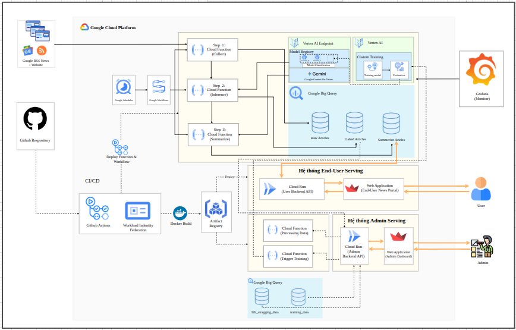

# KLTN 2026 - AI News Pipeline

## 1. Tong quan du an

Du an xay dung mot he thong thu thap, phan loai, tom tat va giam sat tin tuc AI tu dong. Muc tieu la bien luong tin tuc cong nghe AI thanh du lieu co cau truc, de nguoi dung co the theo doi nhanh xu huong, nhan dien nhom noi dung quan trong, va ho tro quy trinh cai tien mo hinh theo vong lap MLOps.

He thong tap trung vao 3 bai toan chinh:

- Thu thap tin tuc AI tu nhieu nguon RSS va website.
- Phan loai bai viet thanh 4 nhan nghiep vu.
- Tao tom tat ngan gon de hien thi tren dashboard va phuc vu nguoi dung cuoi.

Ben canh do, du an con bo sung mot lop HITL (Human-in-the-Loop) va ModelVision de:

- cho phep con nguoi danh gia lai du doan,
- dua du lieu da review vao retraining,
- theo doi training history, drift va deployment cua mo hinh.

## 2. Muc tieu nghiep vu

Du an huong den mot he thong ho tro doc va phan tich tin tuc AI theo cach thuc huu ich hon cho nguoi dung:

- Giam nhieu thong tin nhieu, quang cao, listicle, noi dung kem gia tri.
- Uu tien cac tin co gia tri chien luoc, ky thuat, hoac ung dung thuc te.
- Cung cap tom tat ngan gon bang tieng Viet.
- Tao nen tang de cai tien mo hinh lien tuc dua tren du lieu review thuc te.

## 3. Cac nhan phan loai

He thong su dung 4 nhan chinh:

- `MARKET SIGNALS`: tin tuc chien luoc, thi truong, dau tu, chinh sach, bien dong lon trong nganh AI.
- `SOLUTIONS & USE CASES`: bai viet ve ung dung, cong cu, case study, giai phap trien khai AI.
- `DEEP DIVE`: noi dung chuyen sau ve ky thuat, kien truc mo hinh, benchmark, R&D.
- `NOISE`: noi dung nhieu, quang cao, bai viet it gia tri hoac khong lien quan.

## 4. Kien truc tong the

Kien truc du an duoc to chuc theo dang pipeline tren Google Cloud:

1. `CloudFunction/01_Collection_data` thu thap bai viet tu RSS, crawl noi dung va luu vao BigQuery.
2. `CloudFunction/02_Inference` lay bai chua gan nhan, tien xu ly van ban va goi Vertex AI Endpoint de phan loai.
3. `CloudFunction/03_Sumerize` tom tat bai viet da gan nhan bang Gemini/Vertex AI va luu ket qua vao BigQuery.
4. `Backend/` cung cap API Flask de frontend truy van bai viet, thong ke, nhan, nguon tin va cac thao tac HITL.
5. `Frontend/` la dashboard Streamlit cho nguoi dung cuoi theo doi tin tuc AI.
6. `ModelVision/` la dashboard noi bo de theo doi HITL, lich su training, drift va quan ly mo hinh.
7. `CloudFunction/04_HITL_Preprocess` va `CloudFunction/05_Trigger_Training` dong vai tro cau noi tu review cua con nguoi sang retraining tren Vertex AI.
8. `Training/train_vertex.py` thuc hien retraining, upload artifact, dang ky model va deploy lai endpoint neu dat nguong chat luong.

## 5. Luong xu ly chinh

### 5.1 Thu thap du lieu

- Lay danh sach bai viet tu nhieu RSS feed cong nghe va tin AI.
- Loc bai co lien quan den AI dua tren tap tu khoa.
- Loai bo bai trung lap, bai video, advertorial va noi dung khong phai tin tuc.
- Crawl noi dung chi tiet va luu vao BigQuery bang `raw_articles`.

### 5.2 Phan loai

- Noi dung duoc lam sach va tokenize tieng Viet.
- Mo hinh phan loai duoc deploy tren Vertex AI Endpoint.
- Ket qua gan nhan duoc luu vao `labeled_articles`.

### 5.3 Tom tat

- Cac bai da gan nhan (tru `NOISE`) duoc dua qua pipeline tom tat.
- Gemini sinh `summary`, `key_points`, `keywords` dang JSON co rang buoc schema.
- Ket qua duoc luu vao `summarized_articles`.

### 5.4 Hien thi va tuong tac

- Frontend Streamlit hien thi tong quan, bo loc theo nhan, nguon, khoang thoi gian va danh sach bai viet moi.
- Backend tra ve so lieu thong ke, bai viet, nhan va cac chi so tong hop cho frontend.

### 5.5 HITL va retraining

- Nguoi quan tri co the review va chinh sua nhan trong he thong ModelVision.
- Du lieu da review duoc dua vao `hitl_staging_data`.
- He thong kiem tra cooldown, so luong mau va trang thai job truoc khi kich hoat training moi.
- Mo hinh moi chi duoc deploy neu dat nguong accuracy da dat ra.

## 6. Thanh phan noi bat cua he thong

### Frontend cho nguoi dung cuoi

- Dashboard tin tuc AI bang Streamlit.
- Theo doi so luong bai viet, phan bo nhan, nguon tin, bai viet moi.
- Toi uu cho muc tieu doc nhanh va nam bat xu huong.

### Backend API

- Xay dung bang Flask + CORS.
- Doc du lieu tu BigQuery.
- Ket noi Vertex AI Endpoint cho suy luan.
- Cung cap cac API cho dashboard va luong HITL.

### ModelVision

- Dashboard noi bo danh cho MLOps va van hanh mo hinh.
- Theo doi review HITL, lich su training, data drift, model deployment.
- Tach biet ro giao dien nguoi dung cuoi va giao dien quan tri mo hinh.

### ML/MLOps

- Pipeline training va retraining su dung du lieu goc + du lieu HITL co gan trong so.
- Su dung TF-IDF + mo hinh phan loai nhu `LinearSVC` va `LogisticRegression`.
- Dong bo tu training den deployment qua Vertex AI.

## 7. Cong nghe su dung

- `Python`
- `Flask`
- `Streamlit`
- `Google BigQuery`
- `Google Cloud Functions`
- `Vertex AI`
- `Gemini`
- `scikit-learn`
- `underthesea`
- `Docker`

## 8. Diem manh cua de tai

- Giai quyet bai toan thuc te: qua tai thong tin AI va nhu cau loc noi dung gia tri.
- Ket hop day du Data Pipeline, ML, LLM va MLOps trong cung mot he thong.
- Co co che HITL de tao data flywheel va cai tien mo hinh lien tuc.
- Co hai lop dashboard: mot cho nguoi dung cuoi, mot cho van hanh mo hinh.
- Kha nang mo rong tot tren ha tang Google Cloud.

## 9. Huong trinh bay goi y

Neu dung file nay de thuyet trinh, co the trinh bay theo thu tu:

1. Bai toan va nhu cau loc tin tuc AI.
2. Muc tieu he thong.
3. 4 nhan phan loai va y nghia nghiep vu.
4. Kien truc tong the voi anh `SystemStructure`.
5. Luong du lieu tu crawl -> inference -> summarization -> dashboard.
6. HITL, retraining va ModelVision.
7. Gia tri thuc tien va kha nang mo rong cua de tai.

## 10. Ket luan

Day la mot he thong AI News Pipeline hoan chinh, khong chi dung o muc phan loai tin tuc ma con mo rong sang tom tat noi dung, dashboard hoa thong tin, va khung MLOps voi HITL + retraining. Gia tri chinh cua du an nam o viec bien du lieu tin tuc tho thanh tri thuc co cau truc, de ho tro nguoi dung theo doi thi truong AI nhanh hon va hieu qua hon.
